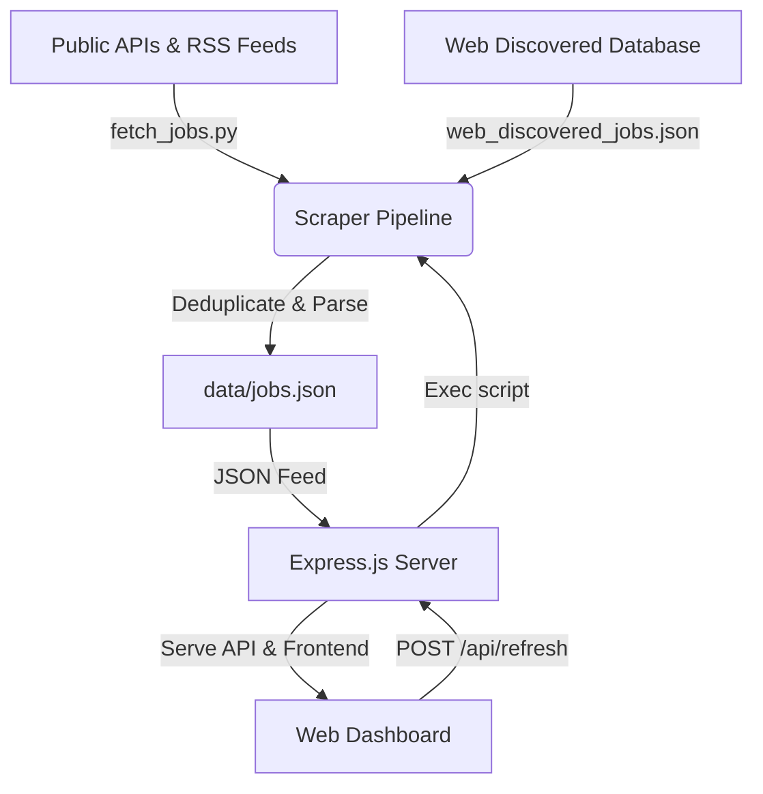

# AuraJob | Premium AI/ML & Data Engineering Job Monitor

AuraJob is a high-fidelity, zero-dependency, self-contained job monitoring dashboard designed to aggregate, rank, filter, and track premium job openings in Artificial Intelligence, Machine Learning, Data Science, Data Engineering, and Data Analysis.

Designed with **glassmorphism** visual aesthetics, neon flows, dark mode gradients, and micro-animations, the dashboard acts as a premium personal developer console for job hunting.

---

## 🌟 Key Features

- **Automated Scraper Pipeline**: A robust, zero-dependency Python script (`fetch_jobs.py`) crawling major developer-friendly job portals (Remotive API, We Work Remotely RSS, Arbeitnow API) using only standard libraries.
- **Dynamic Seeding Engine**: Integrates custom, premium job listings discovered on enterprise portals (e.g. NVIDIA, Goldman Sachs, JPMorgan Chase) and deduplicates them seamlessly with scraped feeds.
- **Harmonious Glassmorphic Dashboard**: A stunning, premium frontend UI featuring HSL tailored colors, ambient glow backdrops, Outfit & Inter typography, and dynamic metrics cards.
- **Interactive Application Tracker (Kanban Board)**: Drag-and-drop style status tracker stored locally in browser `localStorage`, allowing users to move listings across stages like *Applied*, *Interviewing*, *Offers*, and *Closed*.
- **Comprehensive Multi-Attribute Filters**:
  - Filter by roles (AI & ML, Data Engineer, Data Scientist, Data Analyst).
  - Filter by geographic tier regions (India, Europe, Canada, US, Middle-East, Remote Feed).
  - Filter by job model types (In-Office, Hybrid, Remote).
  - Sort by date posted, company A-Z, or title A-Z.
- **Live Background Database Synchronization**: Sync listings on-the-fly directly from the frontend UI via a background request spawning the scraper.

---

## 🏗️ Architecture Blueprint



---

## 🚀 Getting Started

Follow these instructions to set up AuraJob and run it locally.

### Prerequisites

- **Python 3.x**: No external packages required (uses `urllib`, `json`, `re`, `xml` from python standard libraries).
- **Node.js (v16+)**: Required for running the lightweight backend server.

### Local Setup & Installation

1. **Clone the repository**:
   ```bash
   git clone https://github.com/vikrammaditya/aurajob.git
   cd aurajob
   ```

2. **Install Node.js dependencies**:
   ```bash
   npm install
   ```

3. **Perform an initial crawl to populate the database**:
   ```bash
   python fetch_jobs.py
   ```
   *This creates `data/jobs.json` with the consolidated deduplicated postings.*

4. **Start the application server**:
   ```bash
   npm start
   ```

5. **Open the browser**:
   Navigate to **[http://localhost:3000](http://localhost:3000)** to view the premium dashboard.

---

## 💻 Tech Stack & Design Choices

### Core Backend & Scripting
- **Scraper Script**: Python 3 standard libraries (`urllib.request` + `xml.etree.ElementTree` + `re`). Circumvents dependency overhead and maximizes scraper speed/portability on any server environment.
- **Server Framework**: Node.js and Express API server serving static assets and invoking child process executions safely.

### High-Fidelity Frontend UI
- **Styling**: Pure Vanilla CSS3 utilizing CSS custom variables (`:root`), flexbox/grid layout design, and beautiful HSL tailored neon colors (`#6366f1` Indigo, `#06b6d4` Cyan, `#d946ef` Magenta).
- **Glassmorphism Design Elements**: Translucent backgrounds via `backdrop-filter: blur(16px)` and subtle, responsive white borders (`rgba(255,255,255,0.08)`) with radial gradient glowing backdrops.
- **Interactive States**: Local state caching in `localStorage` for Bookmarks and Kanban tracker nodes, ensuring that application stages are preserved permanently in the browser.

---

## 🎯 Configuration & Search Query Rules

- **Job Filtering**: Automatically matches active postings against specified target criteria, prioritizing top-tier AI/ML and Data Engineering roles.
- **Job Category Keywords**: Built-in regex matches titles against:
  - `ai` / `artificial intelligence` / `ml` / `machine learning` / `deep learning` / `nlp` / `computer vision`
  - `data engineer` / `data scientist` / `data analyst` / `data pipeline` / `analytics engineer`
- **Location Ranking Mapping**: Maps regional strings (Germany, UK, USA, etc.) into high-level tiers (India, Europe, Canada, US, Middle East) for structured filtering.

---

## 📄 License

This project is licensed under the MIT License. Feel free to use and modify it for your own job hunting endeavors.
